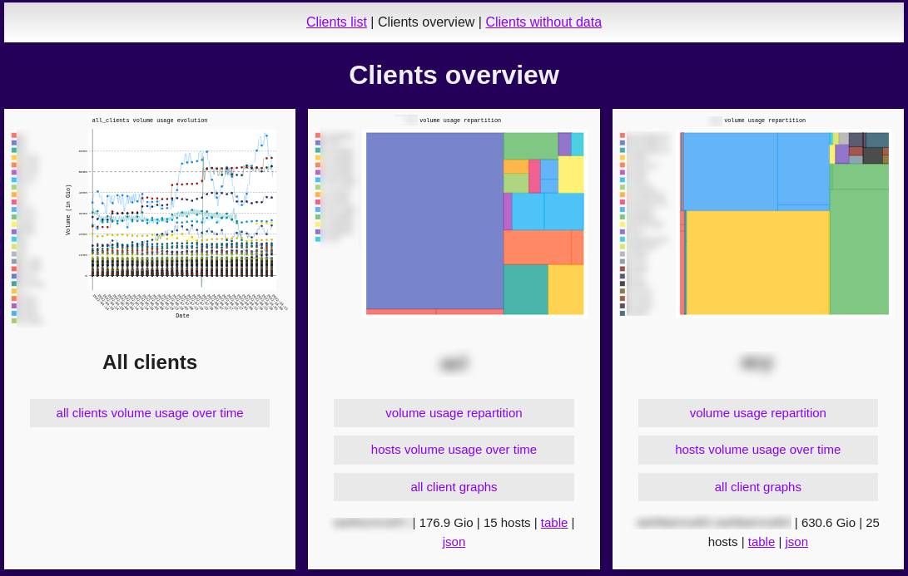
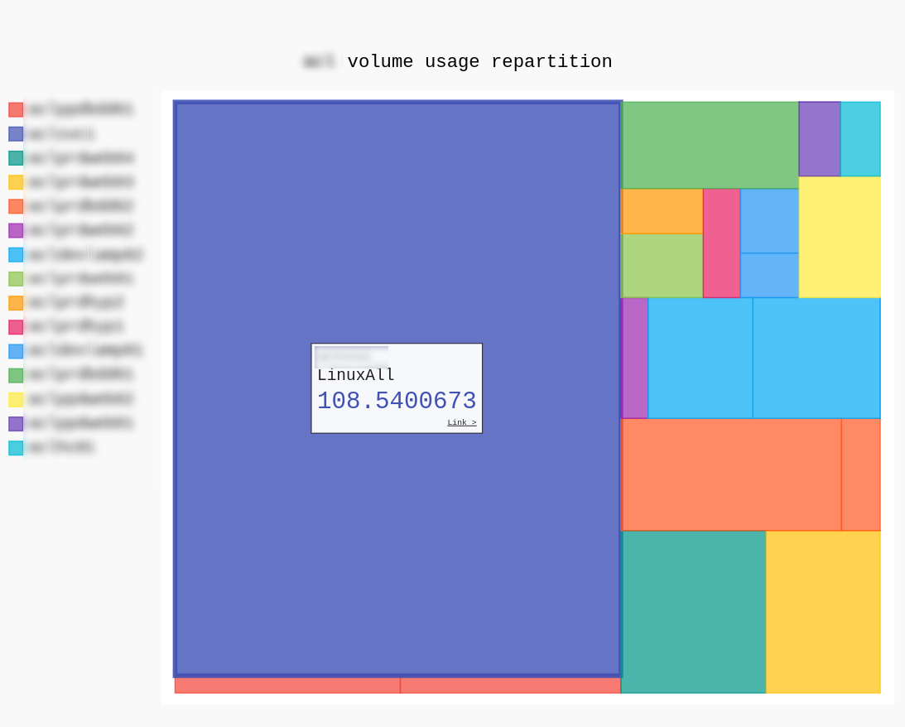
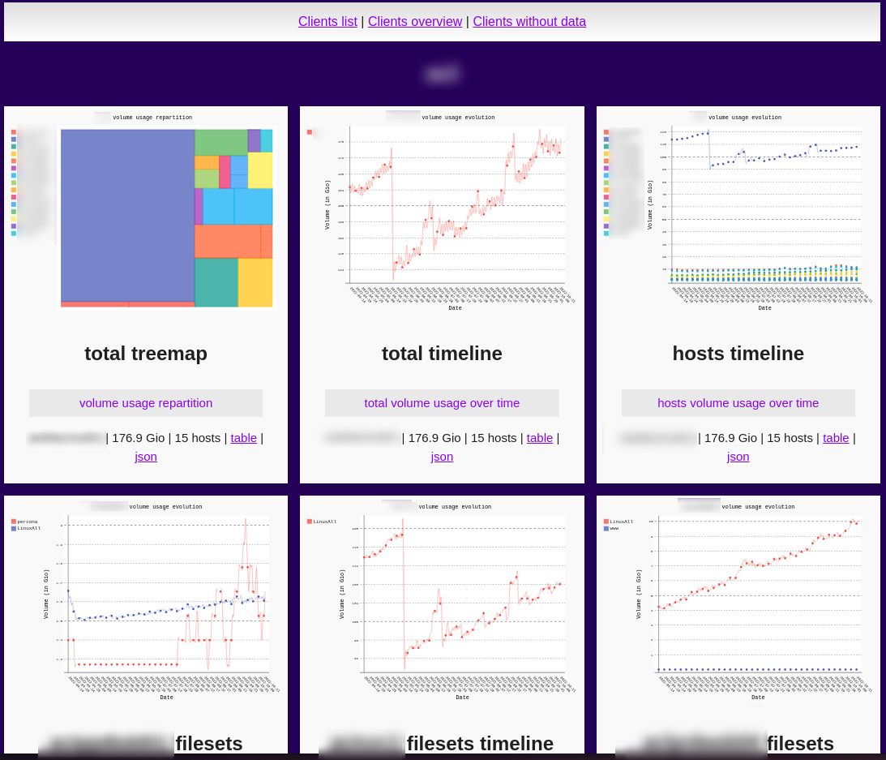

# BareOS/Bacula usage report utility

Static web page, JSON and SVG history and treemap graphs generator for volume usage report on a set of BareOS∕Bacula instances/hosts/jobs.






## Setup

Make sure to have Python 3.7 with Jinja2, Pygal2 and Psycopg2 installed (see `requirements.txt`). For example on Debian run:

```shell
apt install python3-jinja2 python3-psycopg2 python3-pip python3-lxml
pip3 install pygal
```

Copy `bareport.conf.example` to `bareport.conf` and edit it to add:

 * your PostgreSQL instance(s) connection infos (user needs to have read rights on all client databases public.job table).
 * client databases to connect to (facultative, if not specified, will read all databases except the postgres one)
 * the Web data path (make sure that bareport can write into it)

Run `bareport.py` every day and cleanup json files based on how much history you want to keep, for example from a cron :

```crontab
0 6 * * * bareport cd /opt/bareport && /opt/bareport/bareport.py
0 12 * * * bareport find /var/www/bareport/json/ -name '*.json-*' -mtime +30 -delete 
```

Web data are generated into the path chosen in `bareport.conf`. You'll need a web server to serve the generated static files.
